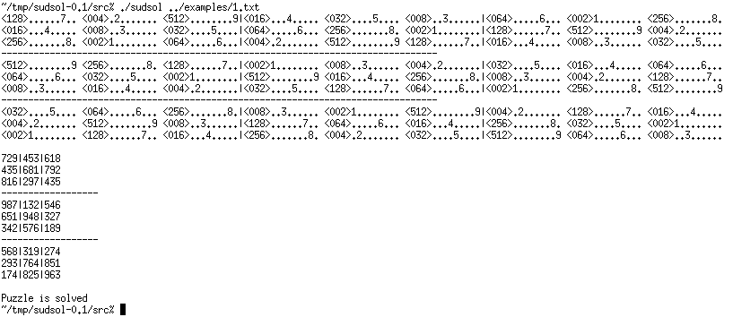

# sudsol

Once upon a time, everyone seemed to be addicted to those [Sudoku puzzles](https://en.wikipedia.org/wiki/Sudoku): fill out a 9x9 square with numbers 1 to 9 without having the same number in a single row or column.

This project is my attempt to provide a 'generic' Sudoku solver, conveniently called _sudsol_. It solved all puzzles I tried on it, but it's probably by no means complete :-)

## Screenshot

## Downloads

  * [Version 0.1](releases/sudsol-0.1.tar.gz) (74KB)
